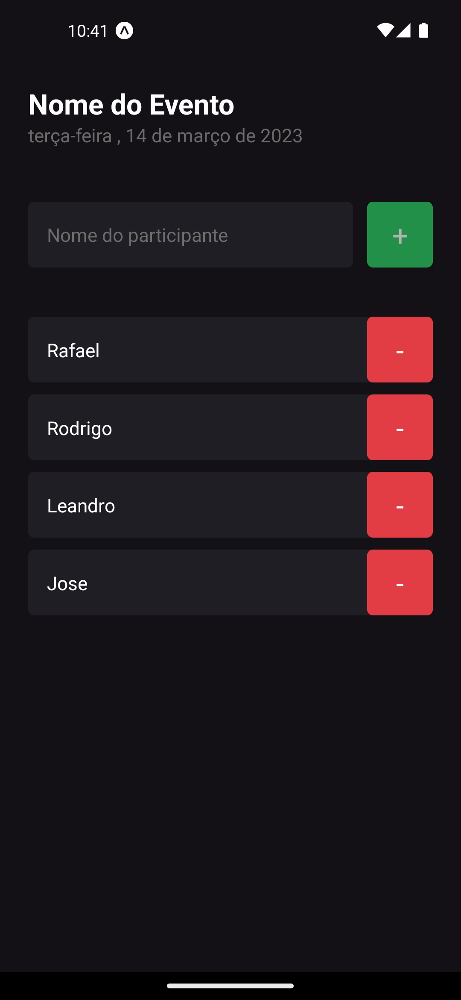
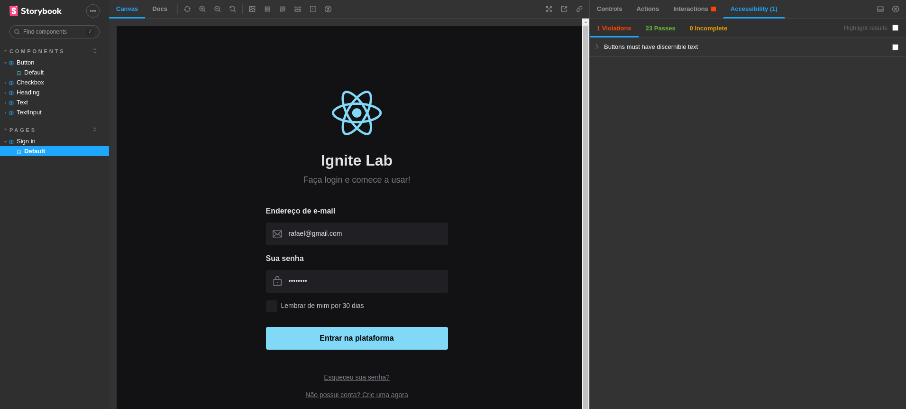
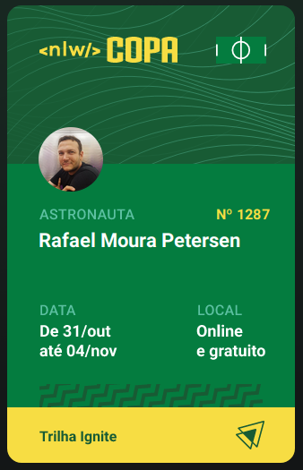
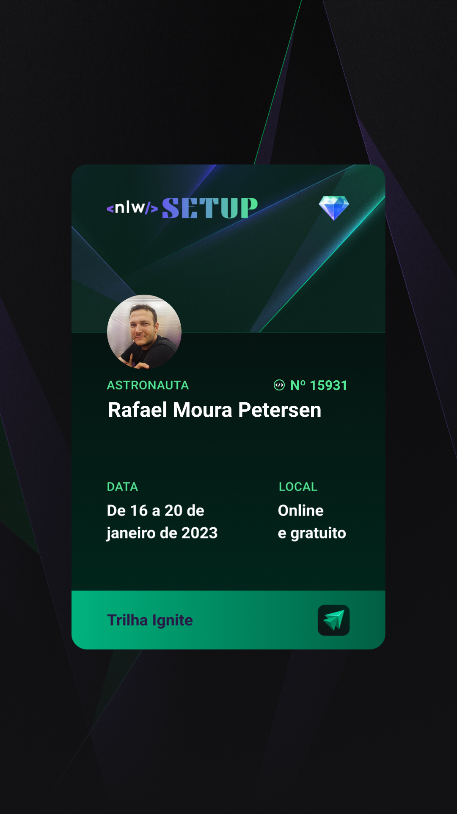
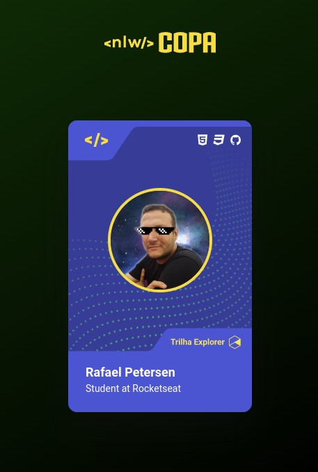
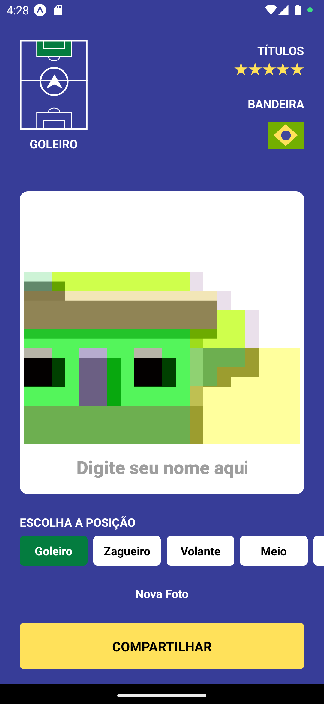

<h1 align="center">  Projetos de eventos e aulas da Rocketseat  </h1>

<table>
    <thead>
        <tr>
            <th>Evento</th>
            <th>Nome</th>
            <th>Data</th>
            <th>Preview</th>
        </tr>
    </thead>
    <tbody>        
         <tr>
            <td>Ignite</td>
            <td><a href="./ignite/iamhere">I am here</a></td>
            <td>14/03/23</td>
            <td align="center" height="150px"></td>
        </tr>
        <tr>
            <td>Explorer Lab #1</td>
            <td><a href="./labs/explorer-lab-01">Cartão Dinâmico</a></td>
            <td>22/10/22</td>
            <td align="center"></td>            
        </tr>
        <tr>
            <td>Ignite Lab #3</td>
            <td><a href="./labs/ignite-lab-design-system">Design System</a></td>
            <td>22/10/22</td>
            <td align="center"></td>            
        </tr>
        <tr>
            <td>NLW #10 - Copa</td>
            <td><a href="./nlw/nlw-copa">Next Level Week - Edição Copa</a></td>
            <td>17/10/22</td>
            <td align="center"></td>
        </tr>
        <tr>
            <td>NLW #11 - Setup</td>
            <td><a href="./nlw/nlwSetup">Next Level Week - Edição Setup</a></td>
            <td>23/01/22</td>
            <td align="center"></td>
        </tr>
        <tr>
            <td>Youtube</td>
            <td><a href="./youtube/copa-card">Crie sua figurinha da copa </a></td>
            <td>25/10/22</td>
            <td align="center"></td>
        </tr>
        <tr>
            <td>Youtube</td>
            <td><a href="./youtube/formulariosNativebase">Formulários com Native Base </a></td>
            <td>25/10/22</td>
            <td align="center"></td>
        </tr>
        <tr>
            <td>Youtube</td>
            <td><a href="./youtube/mysticker">Personalize sua figurinha da Copa com React Native </a></td>
            <td>27/10/22</td>
            <td align="center"></td>
        </tr>
    </tbody>
</table>

---

### Autor

---

<a href="https://www.linkedin.com/in/rafael-petersen-ab827a14a/">
 
  
 <b>Rafael M. Petersen</b></a> <!--  -->

Feito por Rafael M. Petersen; Entre em contato!

 

