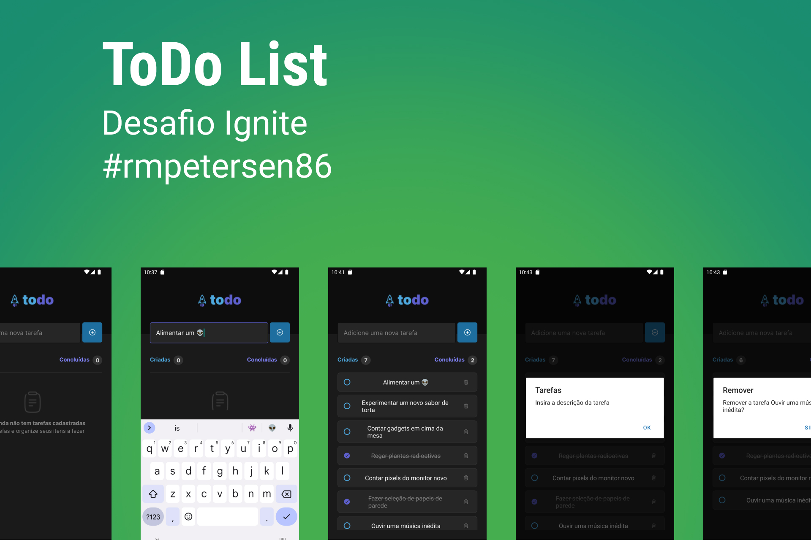

<h1 align="center">  Desafio 01 em React Native - Bootcamp IGNITE  </h1>

<p align="center">
  <a href="#-tecnologias">Tecnologias</a>&nbsp;&nbsp;&nbsp;|&nbsp;&nbsp;&nbsp;
  <a href="#-projeto">Projeto</a>&nbsp;&nbsp;&nbsp;|&nbsp;&nbsp;&nbsp;
  <a href="#-layout">Layout</a>&nbsp;&nbsp;&nbsp;|&nbsp;&nbsp;&nbsp;
  <a href="#memo-licença">Licença</a>&nbsp;&nbsp;&nbsp;|&nbsp;&nbsp;&nbsp;
  <a href="#-instalação">Instalação</a>
</p>

<p align="center">
  
</p>

<br>

<p align="center">
  
</p>

## 🚀 Tecnologias

Esse projeto foi desenvolvido com as seguintes tecnologias:

- [Visual Studio Code](https://code.visualstudio.com/)
- [React Native](https://reactnative.dev/)
- [Expo](https://expo.dev)
- [Typescript](https://www.typescriptlang.org/)

## 💻 Projeto

Desafio do bootcamp Ignite da Rocketseat, que é o projeto de um App para plataforma móvel que permite adicionar tarefas, marcar e desmarcar como concluídas, remover uma tarefa e mostrar a quantidade de tarefas adicionadas e concluídas, o desafio tem seu layout proposto no link para o Figma abaixo e visa fixar os conteúdos apresentados na etapa 1 da trilha ignite de ReactNative, entre os conceitos estão:

- Estados
- Imutabilidade do estado
- Listas e chaves no React Native
- Propriedades
- Componentização

## 📋 Além do código

Além do desafio proposto, foi adicionada a persistência dos dados mesmo ao encerrar o app e executá-lo novamente, utilizando a biblioteca [@react-native-async-storage/async-storage] (https://react-native-async-storage.github.io/async-storage/docs/usage/), além da utilização do hook useEffect para observar a mudança de estado do vetor que armazena as tarefas e sincronizar com o armazenament assíncrono.

## 🔖 Layout

Você pode visualizar o projeto através do [Figma](https://www.figma.com/file/1XfZQGSWk4HWjvwcjd2nOP/ToDo-List/duplicate) e o projeto em funcionamento com [EXPO Snack](https://snack.expo.dev/@r.petersen/github.com-rmpetersen86-rocketseat:ignite-todo-list?platform=android). Ou, executar localmente, instruções na sessão de INSTALAÇÃO

## 📄 Funcionalidades

- [x] Exibir mensagem de lista vazia.
- [x] Adicionar tarefa a lista.
- [x] Impedir de adicionar tarefa sem nome.
- [x] Marcar ou desmarcar uma tarefa como concluída.
- [x] Mudar a apresentação visual da tarefa marcada.
- [x] Remover uma tarefa com confirmação.
- [x] Apresentar realce de cor em componentes ativos.

## 📝 Instalação

### Pré-requisitos

Para executar o código localmente, são necessários os seguintes softwares e ferramentas: [Node.js](https://nodejs.org/en/), [Expo](https://expo.io/), Um dispositivo físico Android/IOS(necessário ter o APP Expo Go) ou um emulador, opcionalmente uma IDE como o [VSCode](https://code.visualstudio.com/) e ferramenta de linha de comando [Git](https://git-scm.com/),

```
# Clone ou baixe este repositório.

$ git clone https://github.com/rmpetersen86/rocketseat/ignite/todo-list.git

# Acesse o diretório onde o repositório foi clonado ou baixado
#Caso tenha sido baixado, descompacte o arquivo e acesse o diretório
$ cd todo-list

# Instale as dependências
$ npm install

# Execute aplicação
$ npx expo start

# Leia o Código QR com o APP Expo GO ou com a Câmera do seu dispositivo ou, com o emulador aberto, no terminal onde o APP está sendo executado, pressione "a" para executar no emulador Android ou I para executar no emulador IOS

```

## :memo: Licença

Esse projeto está sob a licença MIT.

---

### Autor

---

<a href="https://www.linkedin.com/in/rafael-petersen-ab827a14a/">
 
 <br />
 <sub><b>Rafael M. Petersen</b></sub></a> <!-- <a href="https://www.linkedin.com/in/rafael-petersen-ab827a14a/" title="RMPetersen"></a> -->

Feito por Rafael M. Petersen; Entre em contato!

[](https://twitter.com/rafaelpetersen1) [](www.linkedin.com/in/rafael-petersen-ab827a14a)
[](mailto:rafael.petersen86@gmail.com)
