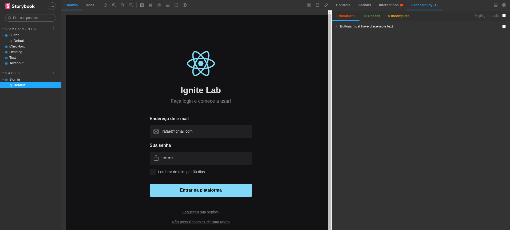

<h1 align="center"> Design System </h1>

<p align="center">
Evento IGNITE LAB promovido pela Rocketseat.
</p>

<p align="center">
  <a href="#rocket-tecnologias">Tecnologias</a>&nbsp;&nbsp;&nbsp;|&nbsp;&nbsp;&nbsp;
  <a href="#-conteudo da aula">Conteúdo</a>&nbsp;&nbsp;&nbsp;|&nbsp;&nbsp;
  <a href="#clipboard-projeto">Projeto</a>&nbsp;&nbsp;&nbsp;|&nbsp;&nbsp;&nbsp;
  <a href="#pencil-layout">Layout</a>&nbsp;&nbsp;&nbsp;|&nbsp;&nbsp;&nbsp;
  <a href="#memo-licença">Licença</a>
</p>

<p align="center">
  
</p>

<br>

<p align="center">
  
</p>

## :rocket: Tecnologias

Esse projeto foi desenvolvido com as seguintes tecnologias:

- [React](https://pt-br.reactjs.org/)
- [Node e NPM](https://nodejs.org/)
- [Expo](https://expo.dev/)
- [Vite](https://vitejs.dev/)
- [Tailwindcss](https://tailwindcss.com/)
- [Storybook](https://storybook.js.org/)
- [Radix-UI](https://www.radix-ui.com/)
- [Figma](https://www.figma.com)
- [Visual Studio Code](https://code.visualstudio.com/)
- [Github](https://github.com/)
- [Github Pages](https://pages.github.com/)
- [Mock Service Worker](https://mswjs.io/)

## :pencil2: Conteúdo da aula

- Criação e padronização de componentes reutilizáveis no Figma
- Criação e exportação de paletas de cores no Figma
- Plugins do Figma: Color Styleguide
- Inicialização do projeto com Vite
- Instalação e configuração do Tailwindcss
- Verificações de acessibilidade com storybook-a11y
- Publicação do Storybook no Github Pages
- Configuração de CD/CI com Storybook-deployer
- Testes automatizados com Storybook interactions, jest, testing-library e test-runner
- Simulação de API com MSW(Mock Service Worker)

## :clipboard: Projeto

O Design System é um sistema que permite padronizar, documentar, visualizar componentes isolados e executar validações de dados e verificações de acessibilidade.

## :pencil: Layout

Você pode visualizar o projeto através do [Github Pages](https://rmpetersen86.github.io/ignite-lab-design-system/?path=/story/components-button--default). Ou, executar localmente, instruções na sessão de INSTALAÇÃO

## :package: Instalação

### Pré-requisitos

Para executar o código diretamente no seu computador, são necessários os seguintes softwares e ferramentas: [Node.js](https://nodejs.org/en/), opcional IDE como o [VSCode](https://code.visualstudio.com/) e ferramenta de linha de comando [Git](https://git-scm.com/),

```
# Clone ou baixe este repositório.

$ git clone https://github.com/rmpetersen86/ignite-lab-design-system.git

# Acesse o diretório onde o repositório foi clonado ou baixado
#Caso tenha sido baixado, descompacte o arquivo e acesse o diretório

$ cd ignite-lab-design-system

# Instale as dependências
$ npm install

# Executar o Storybook
$ npm run storybook

# Caso o Navegador não execute automaticamente exibindo o storybook,
# Acessar através do endereço http://localhost:6006/

# Para executar o layout base
$ npm run dev

# Acessar através do endereço http://localhost:5173/
# ou no endereço apresentado no terminal
```

## :memo: Licença

Esse projeto está sob a licença MIT.

---

### Autor

---

<a href="https://www.linkedin.com/in/rafael-petersen-ab827a14a/">
 
 <br />
 <sub><b>Rafael M. Petersen</b></sub></a> <!-- <a href="https://www.linkedin.com/in/rafael-petersen-ab827a14a/" title="RMPetersen"></a> -->

Feito por Rafael M. Petersen; Entre em contato!

[](https://twitter.com/rafaelpetersen1) [](www.linkedin.com/in/rafael-petersen-ab827a14a)
[](mailto:rafael.petersen86@gmail.com)
