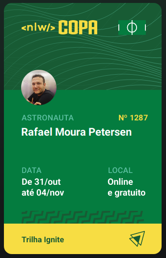

<h1 align="center"> NLW COPA </h1>

<p align="center">
Evento exclusivo promovido pela Rocketseat de 31/10 a 04/11
<a href='https://nlw.rocketseat.com.br/convite/rafael-1287'>Link para o evento</a>
</p>

<p align="center">
  <a href="#rocket-tecnologias">Tecnologias</a>&nbsp;&nbsp;&nbsp;|&nbsp;&nbsp;&nbsp;
  <a href="#clipboard-projeto">Projeto</a>&nbsp;&nbsp;&nbsp;|&nbsp;&nbsp;&nbsp;
  <a href="#pencil-layout">Layout</a>&nbsp;&nbsp;&nbsp;|&nbsp;&nbsp;&nbsp;
  <a href="#memo-licença">Licença</a>
</p>

<p align="center">
  
</p>

<br>

<p align="center">
  
</p>

## :rocket: Tecnologias

### Backend:

- [Node e NPM](https://nodejs.org/)
- [Typescript](https://www.typescriptlang.org/)
- [Fastify](https://www.fastify.io/)
- [Prisma](https://www.prisma.io/)
- [OAuth]()
- [JWT]()

---

### Frontend:

- [Next.js](https://nextjs.org/)
- [TailwindCSS](https://tailwindcss.com/)
- [Axios](https://axios-http.com/ptbr/docs/intro)

---

### Mobile:

- [React Native](https://reactnative.dev/)
- [Expo](https://expo.dev/)
- [Native Base](https://nativebase.io/)
- [Google Fonts](https://fonts.google.com/)
- [React Navigation](https://reactnavigation.org/)
- [Axios](https://axios-http.com/ptbr/docs/intro)

### Promovido por:

- [Rocketseat](https://www.rocketseat.com.br/)

#### Demais bibliotecas e ferramentas:

- [JSON Formatter & Validator](https://jsonformatter.curiousconcept.com/)
- [Insomnia]()
- [VSCode](https://code.visualstudio.com/)
- [Git](https://git-scm.com/)
- [Country List]()
- [React Native Country Flag]()
- [Day.js]()
- [Dot Env]()
- [Babel Plugin Inline Dotenv]()

## :pencil: Pacotes e extensões

- Prisma-erd-generator - Diagramas com base nas configurações do banco de dados
- Mermaid-cli - Geração de diagramas através de códigos
- @fastify/cors - Controle de acesso cross origin
- Zod - Validação de Esquemas
- Short-unique-id - Criação de UUID únicas
- PostCSS - Codificação CSS com JavaScript
- Autoprefixer - Plugin para transcrição do PostCSS

## :clipboard: Projeto

- Em produção ...

## :package: Instalação

### Pré-requisitos

Para executar o projeto, são necessários os seguintes softwares e ferramentas: [Node.js](https://nodejs.org/en/), [Expo](https://expo.io/), Um dispositivo físico Android/IOS(necessário ter o APP Expo Go) ou um emulador, opcional IDE como o [VSCode](https://code.visualstudio.com/) e a ferramenta de linha de comando [Git](https://git-scm.com/),

```
# Clone ou baixe este repositório como zip.

$ git clone https://github.com/rmpetersen86/nlw-copa

#Acesse o diretório onde o repositório foi clonado ou baixado
#Caso tenha sido baixado, descompacte o arquivo e acesse o diretório

$ cd nlw-copa

#Acesse o diretório do Backend e Instale as dependências

$cd backend
$ npm i
$ npx prisma generate

# Execute aplicação
$ npm ...

#Acesse o diretório do Mobile e Instale as dependências

$cd mobile
$ npm i

#Abra o projeto em uma IDE (VSCode) e altere o arquivo src/services/api.ts
# na propriedade "baseURL:" altere para o endereço IP do seu computador.
#É necessário ter uma ID de cliente OAuth2.0 do google e criar um arquivo .env conforme o .env.example adicionando a ID do client na propriedade CLIENT_ID


```

## :memo: Licença

Esse projeto está sob a licença MIT.

---

### Autor

---

<a href="https://www.linkedin.com/in/rafael-petersen-ab827a14a/">
 
 <p align="center">
</p>
 <br />
 <sub><b>Rafael M. Petersen</b></sub></a> <!-- <a href="https://www.linkedin.com/in/rafael-petersen-ab827a14a/" title="RMPetersen"></a> -->

Feito por Rafael M. Petersen; Entre em contato!

[](https://twitter.com/rafaelpetersen1)
[](www.linkedin.com/in/rafael-petersen-ab827a14a)
[](mailto:rafael.petersen86@gmail.com)
