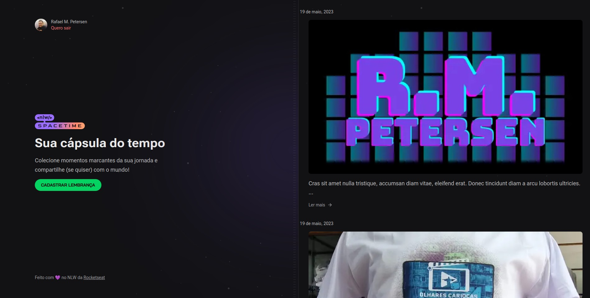

<h1 align="center"> NLW SPACETIME </h1>

<p align="center">
Evento exclusivo promovido pela Rocketseat de 15 a 21 de Maio de 2023
<a href='https://rocketseat.com.br/nlw/convite/rafael-20461'>Link para o convite do evento</a>
</p>

<p align="center">
  <a href="#rocket-tecnologias">Tecnologias</a>&nbsp;&nbsp;&nbsp;|&nbsp;&nbsp;&nbsp;
  <a href="#clipboard-projeto">Projeto</a>&nbsp;&nbsp;&nbsp;|&nbsp;&nbsp;&nbsp;
  <a href="#pencil-layout">Layout</a>&nbsp;&nbsp;&nbsp;|&nbsp;&nbsp;&nbsp;
  <a href="#memo-licença">Licença</a>
</p>

<p align="center">
  
</p>

<br>
<h3>Projeto Web</h3>
<p align="center">
  
</p>
<h3>Projeto Mobile</h3>
<p align="center">
  
  
  
</p>

## :rocket: Tecnologias, Bibliotecas e Plugins

### Backend:

- [Node e NPM](https://nodejs.org/)
- [Typescript](https://www.typescriptlang.org/)
- [ESLint](https://eslint.org/)
- [Fastify](https://www.fastify.io/)
- [Prisma](https://www.prisma.io/)
- [OAuth - Github]()
- [JWT]()
- [Axios](https://axios-http.com/ptbr/docs/intro)
- [ZOD](https://zod.dev/)

---

### Frontend:

- [Next.js](https://nextjs.org/)
- [Typescript](https://www.typescriptlang.org/)
- [TailwindCSS](https://tailwindcss.com/)
- [Lucide](https://lucide.dev/)
- [Axios](https://axios-http.com/ptbr/docs/intro)
- [JWT]()
- [Dayjs](https://day.js.org/)
- [cookies]()
---

### Mobile:

- [React Native](https://reactnative.dev/)
- [Expo](https://expo.dev/)
- [Expo Router](https://docs.expo.dev/guides/routing-and-navigation/)
- [Expo Auth]()
- [ESLint](https://eslint.org/)
- [NativeWind](https://www.nativewind.dev/)
- [TailwindCSS](https://tailwindcss.com/)
- [Google Fonts](https://fonts.google.com/)
- [Expo Google Fonts]()
- [Axios](https://axios-http.com/ptbr/docs/intro)
- [Prettier](https://prettier.io/docs/en/plugins.html)
- [React Native SVG](https://github.com/software-mansion/react-native-svg#installation)
- [React Native SVG Transformer](https://github.com/kristerkari/react-native-svg-transformer)
- [Dayjs](https://day.js.org/)


### Promovido por:

- [Rocketseat](https://www.rocketseat.com.br/)

#### Demais bibliotecas e ferramentas:

- [VSCode](https://code.visualstudio.com/)
- [Git](https://git-scm.com/)
- [Expo Go]()
- [Insomnia]()


## :pencil: Pacotes e extensões

- @fastify/cors - Controle de acesso cross origin
- Zod - Validação de Esquemas
- PostCSS - Codificação CSS com JavaScript
- Prisma Studio - Gerenciamento do banco de dados de desenvolvimento
- SQLite - Banco de dados em arquivo para desenvolvimento da aplicação

## :clipboard: Projeto

- O projeto desenvolvido durante a NLW SpaceTime, é uma capsula do tempo, onde o usuário pode acessar com sua conta do github e cadastrar suas memórias, podendo deixar estas memórias públicas ou não; 

- Durante o evento, além das diversas tecnologias apresentadas, foram demonstradas técnicas para padronizar o código utilizando plugins e configurações na IDE VSCode além de técnicas de desenvolvimento com produtividade utilizando o TAILWINDCSS, que apesar de parecer que torna o código mais extenso, a estilização é executada com muito mais agilidade, o que é mascado utilizando a componentização de elementos.

## :package: Instalação

### Pré-requisitos

Para executar o projeto, são necessários os seguintes softwares e ferramentas: [Node.js](https://nodejs.org/en/), [Expo](https://expo.io/), Um dispositivo físico Android/IOS(necessário ter o APP Expo Go) ou um emulador, opcional IDE como o [VSCode](https://code.visualstudio.com/) e a ferramenta de linha de comando [Git](https://git-scm.com/),

```
# Clone ou baixe este repositório como zip.

$ git clone https://github.com/rmpetersen86/nlw-spaceTime

#Acesse o diretório onde o repositório foi clonado ou baixado
#Caso tenha sido baixado, descompacte o arquivo e acesse o diretório

$ cd nlw-spaceTime
-----------------------BACK END--------------------------
#É necessário ter uma aplicação OAuth configurada no github e criar um arquivo .env conforme o .env.example adicionando a ID do client na propriedade GITHUB_CLIENT_ID e GITHUB_CLIENT_SECRET

#Acesse o diretório do Backend e Instale as dependências

$cd server
$ npm i
$ npx prisma generate

# Execute aplicação
$ npm run dev

---------------------FRONT END WEB---------------------
#É necessário ter uma aplicação OAuth configurada no github e criar um arquivo .env.local conforme o .env.local.example adicionando a ID do client na propriedade NEXT_PUBLIC_GITHUB_CLIENT_ID

#Acesse o diretório do front-end e instale as dependências

$cd web
$npm i
$npm run dev

#será exibido no terminal o endereço e porta que o projeto estará em execução, basta acessar esta URL para visualizar o projeto

-------------------------MOBILE----------------------------
#Acesse o diretório do Mobile e Instale as dependências

$cd mobile
$ npm i

#Abra o projeto em uma IDE (VSCode) e altere o arquivo src/lib/api.ts
# na propriedade "baseURL:" altere para o endereço IP do seu computador.

#Em seguida execute o app com o comando

$npm start


```
# Proximo Nível
Para o próximo nível do projeto, serão implementadas as seguntes atualizações: 
 - Login do tipo OAuth com outra plataforma (Google ou Facebook). 
 
 - Configuração de um armazenamento para imagens (Amazon S3 ou Cloudflare ou Google Cloud Storage)

 - Configuração de Banco de dados (MongoDB ou PostgreSQL)

 - Ajustes nas funções de login e logout

 - Exibição de memórias públicas

 - Exibição de Avatar do usuário no projeto mobile

 - Opção de alterar ou excluir memórias

 - Publicação por tempo limitado em servidores online para execução completa do front-end

 - Publicação nas lojas Google e Apple

## :memo: Licença

Esse projeto está sob a licença MIT.

---

### Autor

---

<a href="https://www.linkedin.com/in/rafael-petersen-ab827a14a/">
 
 <p align="center">
</p>
 <br />
 <sub><b>Rafael M. Petersen</b></sub></a> <!-- <a href="https://www.linkedin.com/in/rafael-petersen-ab827a14a/" title="RMPetersen"></a> -->

Feito por Rafael M. Petersen; Entre em contato!

[](https://twitter.com/rafaelpetersen1)
[](www.linkedin.com/in/rafael-petersen-ab827a14a)
[](mailto:rafael.petersen86@gmail.com)
