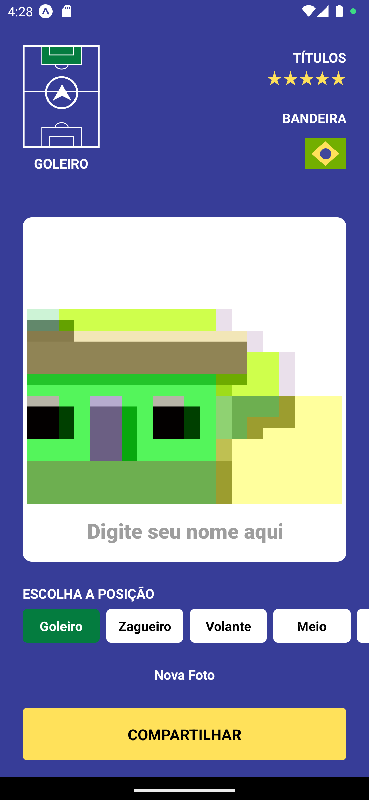

<h1 align="center"> MySticker </h1>

<p align="center">
Video aula publicada pela Rocketseat em 28/10/2022
<a href='https://www.youtube.com/watch?v=Z1aSHtPCAP4'>Link para a Aula</a>
</p>

<p align="center">
  <a href="#rocket-tecnologias">Tecnologias</a>&nbsp;&nbsp;&nbsp;|&nbsp;&nbsp;&nbsp;
  <a href="#clipboard-projeto">Projeto</a>&nbsp;&nbsp;&nbsp;|&nbsp;&nbsp;&nbsp;
  <a href="#pencil-layout">Layout</a>&nbsp;&nbsp;&nbsp;|&nbsp;&nbsp;&nbsp;
  <a href="#memo-licença">Licença</a>
</p>

<p align="center">
  
</p>

<br>

<p align="center">
  
</p>

## :rocket: Tecnologias

Esse projeto foi desenvolvido com as seguintes tecnologias:

- [React Native](https://reactnative.dev/)
- [Node e NPM](https://nodejs.org/)
- [Expo](https://expo.dev/)

## :clipboard: Projeto

O Mysticker é um app que permite personalizar e compartilhar uma figurinha com nome, foto e posição de jogo.

## :pencil: Layout

Você pode visualizar o projeto através do [EXPO Snack](https://snack.expo.dev/@git/github.com/rmpetersen86/mysticker). Ou, executar localmente, instruções na sessão de INSTALAÇÃO

## :package: Instalação

### Pré-requisitos

Para executar o código diretamente no seu computador, são necessários os seguintes softwares e ferramentas: [Node.js](https://nodejs.org/en/), [Expo](https://expo.io/), Um dispositivo físico Android/IOS(necessário ter o APP Expo Go) ou um emulador, opcional IDE como o [VSCode](https://code.visualstudio.com/) e ferramenta de linha de comando [Git](https://git-scm.com/),

```
# Clone ou baixe este repositório.

$ git clone https://github.com/rmpetersen86/mysticker.git

# Acesse o diretório onde o repositório foi clonado ou baixado
#Caso tenha sido baixado, descompacte o arquivo e acesse o diretório

$ cd mysticker

# Instale as dependências
$ npm install

# Execute aplicação
$ npm start

# Leia o Código QR com o APP Expo GO ou com a Câmera do seu dispositivo ou, com o emulador aberto, no terminal onde o APP está sendo executado, pressione "a" para executar no emulador Android ou I para executar no emulador IOS

```

## :memo: Licença

Esse projeto está sob a licença MIT.

---

### Autor

---

<a href="https://www.linkedin.com/in/rafael-petersen-ab827a14a/">
 
 <br />
 <sub><b>Rafael M. Petersen</b></sub></a> <!-- <a href="https://www.linkedin.com/in/rafael-petersen-ab827a14a/" title="RMPetersen"></a> -->

Feito por Rafael M. Petersen; Entre em contato!

[](https://twitter.com/rafaelpetersen1) [](www.linkedin.com/in/rafael-petersen-ab827a14a)
[](mailto:rafael.petersen86@gmail.com)
